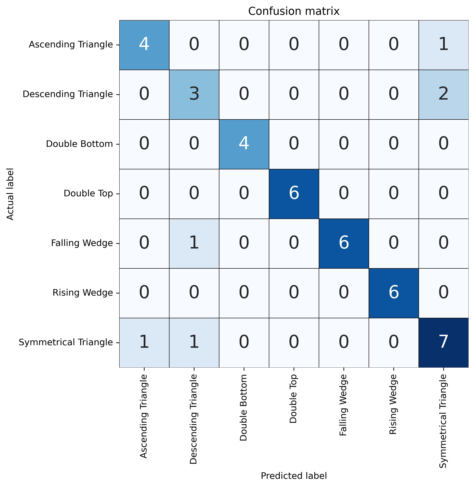
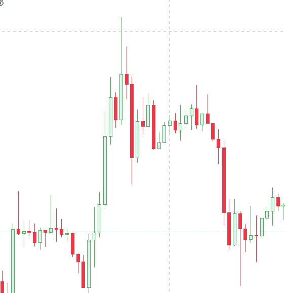

# RNN - Predic Pattern Crypto

## Description
This project is a simple example of how to use RNN to predict a pattern in a crypto currency.

## Pattern anvailable
- Ascending Triangle
- Descending Triangle
- Symmetrical Triangle
- Double Top
- Double Bottom
- Falling Wedge
- Rising Wedge

## Requirements
- Python 3.10

## How to run
- Install the requirements
- Run the command `python train.py`
- Run the command `python predict.py`

## Confusion Matrix

## Example of prediction

### Predicted pattern: Double Top | Confiance : 97%

## Credits

- [DelityLuss]("https://github.com/DelityLuss")

 
