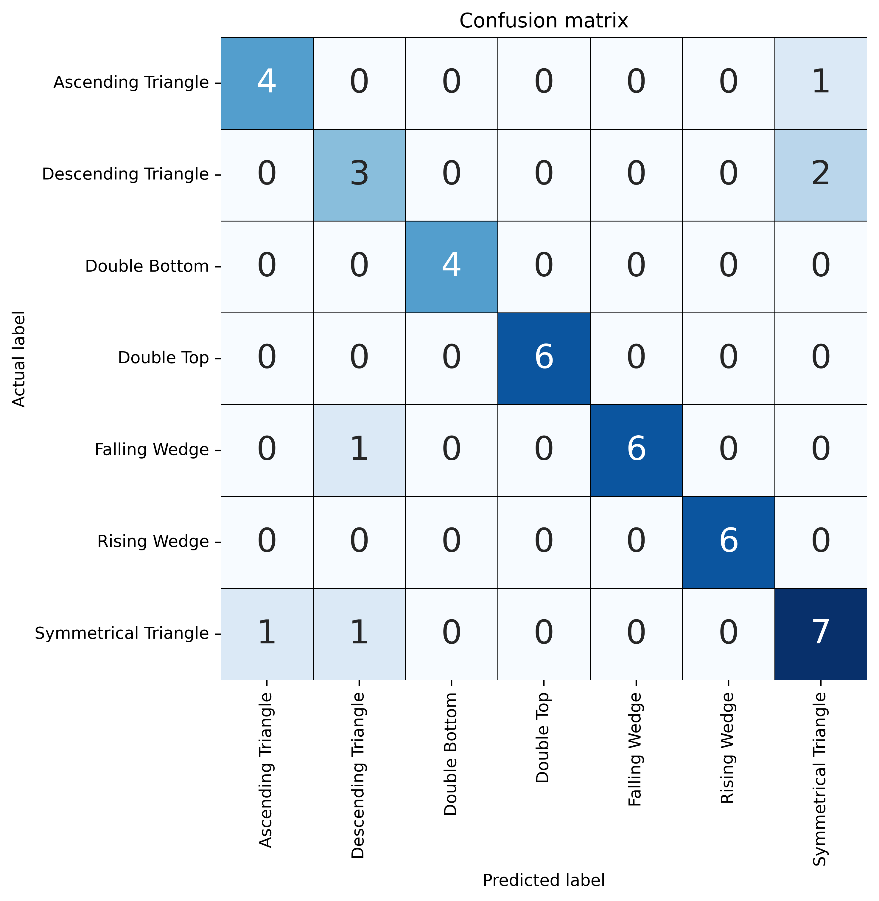
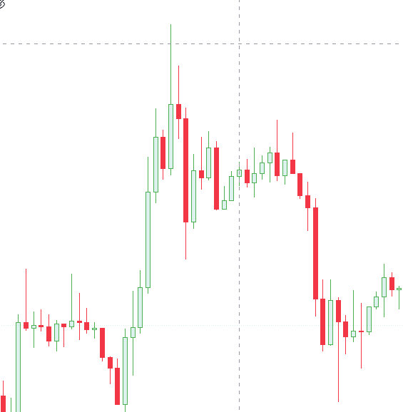

# RNN - Predic Pattern Crypto

## Description
This project is a simple example of how to use RNN to predict a pattern in a crypto currency with pictures. The model is trained with 7 patterns and can predict the pattern with a ~93% accuracy.

## Pattern anvailable
- Ascending Triangle
- Descending Triangle
- Symmetrical Triangle
- Double Top
- Double Bottom
- Falling Wedge
- Rising Wedge

## Requirements
- Python 3.10

## Load existing model
- Download the model [here](https://1drv.ms/u/s!AsAMvk62q-sfhK5VhIH6d5uI2nWHnA?e=V1f5wY)

## How to run
- Install the requirements with `pip install -r requirements.txt`
- Run the train `python train.py`
- Run prediction `python predict.py`

## Confusion Matrix

## Example of prediction

### Predicted pattern: Double Top | Confiance : 97%

## Credits

- [DelityLuss]("https://github.com/DelityLuss")

 
